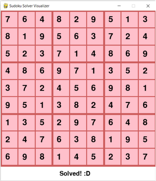

# Sudoku-Backtracking-Visualizer
This is a sudoku solver visualizer using the backtracking algorithm. It includes a graphical GUI using pygame library.

To play sudoku and/or visualize solving, run solver.py.

# Instructions
To play sudoku, click a box and hit a number from 1-9 on your keyboard to fill in. If the entered value is a possible correct value for the board in its current state, the box will fill. If not, the box will remain empty. You can move to another box using arror keys or mouse.

For autosolving, press Enter key without entering values and visualize the process.

   -------------------------------------------------------------------------------------------------------------------------------------------------------------------------

Initial State

Solving State

Final State

